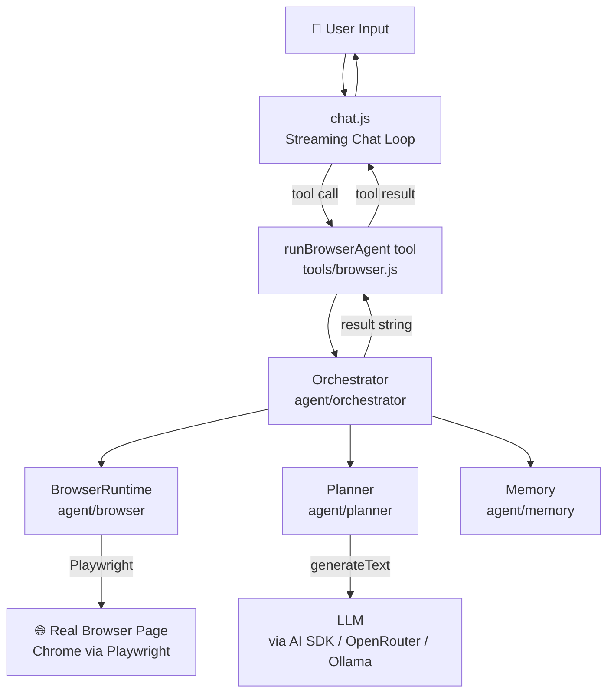
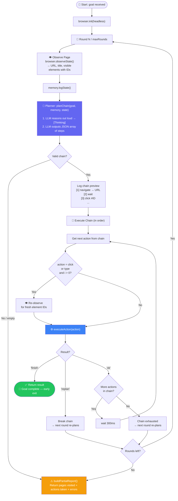
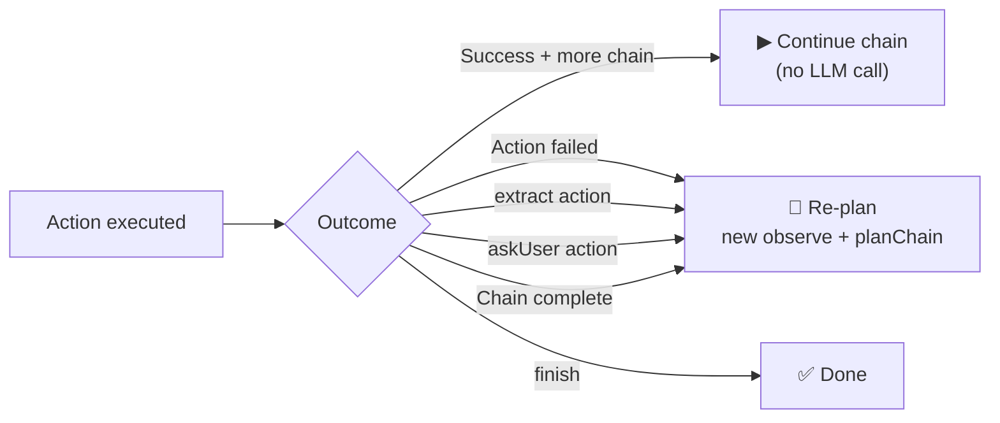
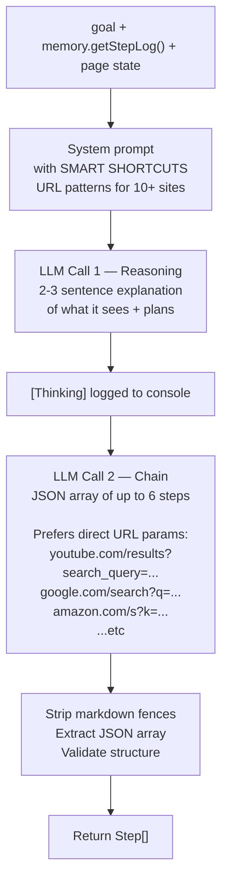

# Browser Agent — Architecture & Workflow

A chain-based autonomous browser agent. The model plans a full sequence of actions upfront, the orchestrator runs them in bulk, and only re-plans when something goes wrong or it hits a step that needs live page data.

---

## High-Level Architecture



---

## Main Execution Loop (Chain Mode)



---

## When Re-Planning is Triggered



**Static actions** (run without LLM): `navigate` · `wait` · `scroll` · `pressEnter`

**Dynamic actions** (re-observe before executing): `click` · `type`

**Triggers re-plan**: failure · `extract` · `askUser` · chain exhausted

---

## Planner Intelligence



---

## Memory — Step Log Format

The planner always receives a compact, human-readable trace:

```
🌐 Page: https://www.youtube.com/results?search_query=nayab+seedhe+maut | "YouTube" | 41 elements
➡️  navigate → https://www.youtube.com/results?search_query=nayab+seedhe+maut
✓  Loaded https://www.youtube.com/results?search_query=nayab+seedhe+maut
🖱️  click #7
✗  FAILED: Element not visible
🔽 scroll down
✓  Scrolled down
🖱️  click #12
✓  Clicked #12
```

Memory caps: **last observed page** + **last 8 action/outcome pairs** — keeps planner context small regardless of session length.

---

## File Structure

```
agentBrowser/
├── chat.js                     # Entry point — streaming chat loop
├── config.js                   # Provider, model, system prompt
├── tools/
│   └── browser.js              # runBrowserAgent tool (zod schema + execute)
├── agent/
│   ├── orchestrator/index.js   # Main loop — chain execution engine
│   ├── planner/index.js        # planChain() — LLM reasoning + JSON array output
│   ├── browser/index.js        # BrowserRuntime — Playwright wrapper
│   └── memory/index.js         # Trace log — actions, outcomes, observations
└── lib/
    ├── ai.js                   # Provider setup (OpenRouter / Ollama)
    └── ui.js                   # CLI banner + response boxes
```

---

## Token Efficiency

| Old (step-by-step) | New (chain mode) |
|---|---|
| 1 LLM call per action | 2 LLM calls per **round** (reason + chain) |
| 25 steps = ~50 LLM calls | 25 rounds, but each runs 1–6 actions |
| Re-plan every step | Re-plan only on failure or dynamic boundary |
| Context grows unboundedly | Memory capped at last observe + 8 pairs |
